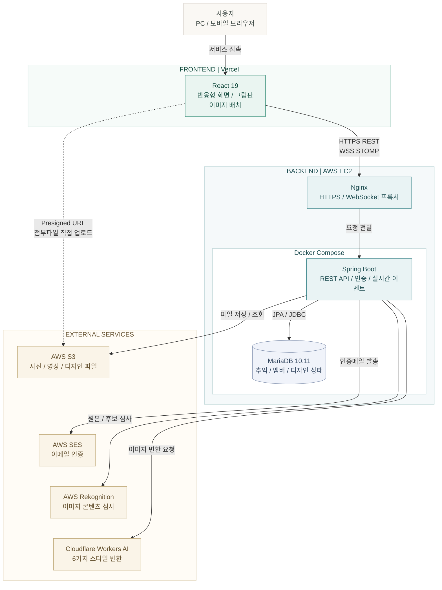
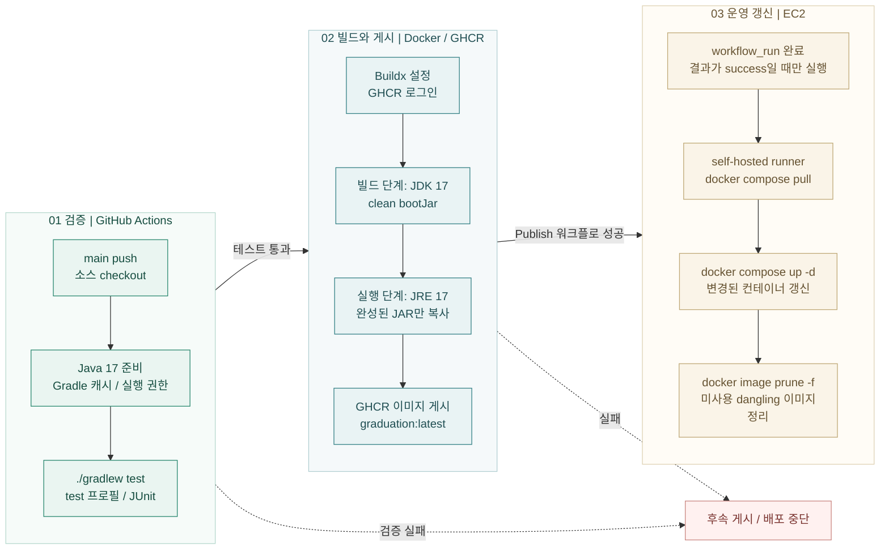

# Memory Jar

**소중한 사람들과 추억을 모으고 약속한 날 함께 열어보는 비공개 추억 공유 서비스**

[🌿 서비스 둘러보기](https://www.esjh.shop)　|　[🧩 설계와 문제 해결](#주요-설계와-문제-해결)　|　[🧪 테스트와 검증](#테스트와-검증)　|　[🚀 로컬 실행 안내](#로컬-실행)

## 어떤 프로젝트인가요?

함께 보낸 하루 중 오래 기억하고 싶은 순간들을 쪽지에 적어 저금통에 모았습니다. 약속한 날 쪽지를 하나씩 펼쳐 읽으며 그때의 웃음과 마음을 다시 나누었습니다.

> **서로 멀리 떨어져 있어도 같은 곳에 추억을 모을 수 있다면 어떨까요?**

Memory Jar는 그 마음에서 시작했습니다. 연인, 가족, 친구가 어디에 있든 하나의 저금통을 함께 채우고 약속한 날 다시 열어보는 공간입니다. 기록을 저장하는 것에 그치지 않고 **모으는 설렘과 기다림.. 함께 꺼내 읽는 순간**을 담고 싶었습니다.

**개인 프로젝트 | 2026년 2월 ~ 개발 중 |**

백엔드와 프론트엔드 개발부터 DB 설계, 테스트, 배포 구성까지 직접 담당합니다.

## 주요 설계와 문제 해결

### 1. 행 잠금으로 최초 리액션과 정원 변경의 동시 요청 정합성 보호

리액션이 아직 없는 경우도 **부모 Note를 공통 잠금 기준**으로 사용합니다.
초대 참여와 정원 변경은 같은 Jar를 잠그고 동시에 실행되어도 변경된 정원을 초과하지 않도록 처리했습니다.

문제 | 설계 선택 | MariaDB 검증 보기

- **문제:** 첫 리액션에는 잠글 행이 없고 초대 참여와 정원 변경을 따로 검사하면 인원 제한을 어길 수 있습니다.
- **설계:** 부모 행 잠금과 `READ_COMMITTED`로 최신 상태를 확인합니다. 같은 이모지를 다시 누르면 취소되는 기존 토글 규칙은 유지합니다.
- **검증:** 실제 MariaDB에서 최초 리액션 동시 토글과 정원 축소, 초대 참여의 경쟁을 확인했습니다. 정원 경쟁은 6회 실행했습니다.
- **트레이드오프:** 같은 부모의 쓰기는 순차 처리하므로 높은 쓰기 부하에서는 잠금 대기를 관찰해야 합니다.

[리액션 구현](src/main/java/shop/esjh/memoryjar/service/note/NoteReactionService.java) | [정원 처리](src/main/java/shop/esjh/memoryjar/service/jar/JarService.java) | [동시성 테스트](src/test/java/shop/esjh/memoryjar/service/WriteSafetyIntegrationTest.java)

### 2. 실시간 메시지 전달 직전 권한과 세션 재검사

로그인이나 구독할 때만 확인하지 않고 **메시지를 전달하는 순간에도 현재 권한을 검사**합니다.
강퇴 또는 탈퇴 이후의 수신과 비밀번호 재설정 이전 세션의 접근을 차단하도록 개선했습니다.

인증 이후에도 권한을 확인하는 구조 보기

- **문제:** 구독 당시 유효했던 권한도 이후 강퇴, 탈퇴, 비밀번호 재설정으로 달라질 수 있습니다.
- **설계:** 전달 직전에 멤버 권한, 토큰 만료, DB 세션 버전을 확인합니다. 비밀번호 재설정은 Refresh Token 폐기와 세션 버전 변경을 함께 처리합니다.
- **검증:** 전달 인터셉터와 세션 유효성은 단위 테스트로 세션 변경과 채팅 처리의 경쟁은 통합 테스트로 확인했습니다.
- **범위:** 이후 검사에서 전달을 차단하고 연결 종료를 시도합니다. 이미 전달된 메시지의 회수나 권한 변경과 소켓 종료의 원자적 동시 처리를 보장하지는 않습니다.

[전달 권한 검사](src/main/java/shop/esjh/memoryjar/config/WebSocketDeliveryAuthorizationInterceptor.java) | [세션 검사](src/main/java/shop/esjh/memoryjar/jwt/SessionValidityService.java) | [통합 테스트](src/test/java/shop/esjh/memoryjar/service/SessionAndChatConcurrencyIntegrationTest.java)

### 3. DB와 S3 부분 실패에도 재시도 가능한 AI 파일 정리

AI 이미지 업로드와 DB 저장이 서로 다른 시점에 실패할 수 있음을 고려했습니다.
**업로드 예약 키와 삭제 완료 이력**을 남겨 보상 삭제가 실패해도 스케줄러가 다시 정리할 수 있도록 설계했습니다.

외부 서비스 실패와 복구 흐름 보기

- **문제:** DB와 S3를 하나의 트랜잭션으로 되돌릴 수 없어 업로드, DB 저장, 삭제 중 일부만 성공하면 파일이 남을 수 있습니다.
- **설계:** V48에서 업로드 전 예약 키를 기록하고 삭제 성공 시각을 별도 관리합니다. 외부 I/O는 DB 트랜잭션 밖에서 수행합니다.
- **보호:** 업로드 완료 여부가 모호하면 유예하고 삭제 직전 상태와 키를 재검사해 성공 후보를 보호합니다. S3 정리용 스케줄러를 분리해 자동 오픈과 세션 검사에 영향을 줄입니다.
- **검증:** 보상 삭제, 재시도, 성공 후보 보호 테스트와 MariaDB V47→V48 업그레이드를 확인했습니다. V48 이전에 이미 잃어버린 키는 자동 복구하지 않습니다.

[생성 처리](src/main/java/shop/esjh/memoryjar/service/ai/JarAiGenerationService.java) | [정리 처리](src/main/java/shop/esjh/memoryjar/service/ai/AiDraftCleanupService.java) | [V48 검증 기록](docs/WRITE_SAFETY_V48.md)

### 4. 깊은 답글을 유지하면서 댓글 조회와 삭제 비용 개선

댓글은 **작성자를 함께 읽는 커서 페이지 조회**, 깊은 답글은 **재귀 대신 반복 처리**로 변경했습니다.
알림 대상의 조상 경로를 추가해도 페이지 커서가 건너뛰지 않도록 분리했습니다.

조회 최적화와 깊은 답글 검증 보기

- **문제:** 전체 댓글 조회, 작성자 지연 조회, 깊은 재귀 처리는 데이터가 늘수록 비용과 호출 스택 부담이 커집니다.
- **설계:** ID 커서와 작성자 동시 조회를 사용합니다. 일반 페이지 커서는 알림 대상 경로와 분리하고 하위 답글 삭제는 최대 500 ID씩 반복 처리합니다.
- **검증:** MariaDB에서 1,100단계 답글의 페이지 조회와 삭제, Node 테스트에서 10,000단계 트리 탐색을 확인했습니다.
- **범위:** 답글 깊이에 새 제한을 두지 않습니다. 구 클라이언트용 전체 조회와 매우 깊은 화면 렌더링 비용은 남아 있습니다.

[댓글 처리](src/main/java/shop/esjh/memoryjar/service/note/NoteCommentService.java) | [프론트 페이지와 트리 처리](frontend/src/features/jarDetail/utils/commentPaging.mjs) | [조회 테스트](src/test/java/shop/esjh/memoryjar/service/WriteSafetyQuerySmokeTest.java)

## 핵심 기능

- **함께 채우는 저금통:** 초대코드 참여, 멤버 역할과 정원 관리, 공개 날짜와 잠금 정책
- **추억 기록과 다시 보기:** 300자 쪽지와 사진, 영상, 목록 조회와 검색, 자동 오픈, 오늘의 추억 한 장
- **실시간 소통:** 채팅, 읽음 위치, 알림, 쪽지 리액션, 댓글, 답글
- **나만의 외형:** 직접 그리기, 이미지 배치, 입구 편집, 6가지 AI 스타일 변환과 후보 비교
- **계정 관리:** 이메일 인증, 자체 로그인, 네이버와 Google 및 카카오 소셜 로그인, 계정 복구.

[서비스 기능과 정책 자세히 보기](docs/PROJECT_OVERVIEW.md)

## 기술 스택

### Backend

### Database

### Frontend

### Infrastructure & Cloud

### Test & Performance

## 시스템 구성

사용자 요청은 Nginx를 거쳐 Spring Boot로 전달됩니다.
파일 업로드는 Presigned URL로 S3에 직접 연결하고, 인증메일과 이미지 심사, AI 변환은 백엔드가 외부 서비스와 연동합니다.

**실선은 일반 요청 경로, 점선은 브라우저의 직접 파일 업로드 경로**입니다.
실시간 메시지는 현재 단일 Spring Boot 인스턴스의 Simple Broker를 사용합니다.

🚢 테스트부터 배포까지의 흐름 보기

**백엔드는 검증과 이미지 게시를 마친 뒤에만 운영 컨테이너를 갱신합니다.**
하나의 흐름을 검증, 이미지 패키징, 운영 반영의 세 단계로 나누었습니다.

### 1. 테스트를 통과한 변경만 이미지로 게시

`main`에 push하면 GitHub-hosted Ubuntu runner가 소스를 가져오고 Java 17과 Gradle 캐시를 준비합니다.
`./gradlew test`는 `test` 프로필로 실행하며, 단위 테스트뿐 아니라 MariaDB Testcontainers 기반 Repository, 동시성, 마이그레이션 테스트도 포함합니다.

테스트가 실패하면 이후 이미지 빌드와 게시를 진행하지 않습니다.
이 단계는 운영 DB가 아닌 시험용 DB와 설정을 사용하며, 프론트 테스트나 브라우저 회귀 테스트는 이 워크플로에 포함되지 않습니다.

### 2. 빌드 환경과 실행 환경을 분리한 Docker 이미지 생성

Buildx를 설정하고 `GITHUB_TOKEN`으로 GHCR에 로그인합니다. Dockerfile은 다음 두 단계로 애플리케이션을 패키징합니다.

| 단계 | 처리 |
| --- | --- |
| Build — JDK 17 | Gradle Wrapper와 소스를 복사한 뒤 `./gradlew --no-daemon clean bootJar`로 실행 가능한 JAR 생성 |
| Runtime — JRE 17 | 빌드 결과 JAR만 복사하고 `java -jar`로 실행. 빌드용 JDK와 소스는 최종 이미지에 포함하지 않음 |

**테스트는 이미지 빌드 이전의 별도 CI 단계에서 실행합니다.** Dockerfile의 `bootJar` 단계가 테스트를 다시 실행하는 것은 아닙니다.
완성한 이미지는 `ghcr.io/dlawhd/graduation:latest`로 게시합니다. 현재 태그는 `latest`이며 배포 워크플로가 특정 커밋 SHA나 이미지 digest를 고정하지는 않습니다.

### 3. 성공한 Publish 작업만 운영 Compose에 반영

`deploy` 워크플로는 이미지 게시 워크플로의 `workflow_run: completed` 이벤트를 받고,
`conclusion == 'success'`인 경우에만 self-hosted runner에서 실행합니다. 빌드나 게시가 실패하거나 취소되면 운영 갱신 작업은 실행하지 않습니다.

운영 배포 디렉터리에서 다음 순서로 처리합니다.

| 명령 | 역할 |
| --- | --- |
| `docker compose -f docker-compose.prod.yml pull` | Compose에 선언된 서비스의 이미지를 가져옴 |
| `docker compose -f docker-compose.prod.yml up -d` | 변경된 이미지를 사용하는 컨테이너를 갱신하고 백그라운드로 실행 |
| `docker image prune -f` | 컨테이너가 사용하지 않는 dangling 이미지를 정리 |

새 API가 기동하면 현재 애플리케이션 설정에 따라 Flyway 마이그레이션과 Hibernate 스키마 검증을 수행합니다.
다만 `up -d` 이후 워크플로가 API 준비 완료까지 기다리거나 HTTP 응답을 확인하는 단계는 없습니다.

같은 `deploy` concurrency 그룹에는 `cancel-in-progress: true`를 적용합니다.
새 배포 작업이 시작되면 이전 실행을 취소하도록 설정하지만, 이미 실행된 명령을 되돌리거나 부분 반영을 복구하는 기능은 아닙니다.

### 자동화 범위와 운영 확인

- **프론트:** Vercel에 별도로 배포합니다. 위 GitHub Actions는 백엔드 테스트와 컨테이너 배포만 담당합니다.
- **운영 확인:** API 응답, 컨테이너 상태, 기동 로그와 Flyway 적용 결과는 별도로 확인해야 합니다. 이 확인은 현재 배포 워크플로의 자동 단계가 아닙니다.
- **현재 한계:** 무중단 전환, 실패 시 자동 롤백, 이미지 digest 고정은 이 워크플로에 구현되어 있지 않습니다. 작업 성공과 서비스 정상 기동은 구분합니다.
- **설정 보호:** 운영 Compose 파일과 인증정보는 저장소에 포함하지 않습니다. 운영 Compose의 상세 건강 검사나 리소스 제한은 이 저장소만으로 확인할 수 없습니다.

[📦 검증과 이미지 게시 워크플로](.github/workflows/publish-ghcr.yml) | [🚢 운영 배포 워크플로](.github/workflows/deploy.yml) | [🐳 다단계 Dockerfile](Dockerfile) | [🧪 로컬 검증 방법](docs/LOCAL_DEVELOPMENT.md#먼저-코드-검증하기)

## 테스트와 검증

**기능 구현뿐 아니라 실제 DB 동시성, 마이그레이션, PC/모바일 동작까지 검증했습니다.**

| 검증 | 기록 |
| --- | --- |
| 백엔드 | 전체 테스트 **1,683개 통과**, `test bootJar` 성공 |
| 실제 MariaDB | 쓰기 안전성 4개와 V47→V48 업그레이드 1개 통과 |
| 프론트 | 유틸리티 테스트 **82개 통과**, PC 1440px / 모바일 390px 회귀 통과 |
| 읽기 부하 | 최대 **300 VU**, 요청 실패율 **0%**, **p95 85.01ms** |

측정 조건과 검증 범위 보기

- **로컬 검증:** 2026-10-05 기준 커밋  백엔드 실패, 오류, 건너뜀 0개. MariaDB 10.11 Testcontainers를 사용했으며 운영 데이터와 설정을 그대로 재현한 것은 아닙니다.
- **브라우저 검증:** 실제 React 화면에 시험용 REST와 WebSocket 응답을 연결했습니다. 이 검증에서는 운영 DB, 실제 S3, SES, 유료 AI를 호출하지 않았습니다.
- **읽기 부하:** 2026-09-30 공유된 k6 콘솔 기록. 30초 상승 → 2분 유지 → 30초 하강, 요청 사이 2~5초 생각 시간. 12,813건, 전체 평균 69.92 req/s, 평균 43.03ms / p99 275.10ms.
- **해석:** 300 VU는 300 RPS나 서로 다른 계정 300명이 아닙니다. 인증 쿠키를 공유하는 GET 시나리오이며 쓰기, AI, WebSocket 전체 처리량으로 일반화하지 않습니다. 원시 결과 파일은 저장소에 포함되어 있지 않습니다.
- **빌드:** 프론트 Vite 빌드는 성공했지만 기존 대형 JavaScript 청크 경고는 남아 있습니다. 테스트 통과가 운영 환경의 무결함을 의미하지는 않습니다.

[상세 검증 기록](docs/WRITE_SAFETY_V48.md) | [브라우저 테스트](frontend/tests/write-safety.browser.cjs) | [k6 시나리오](k6/user-journey-read.js)

## 로컬 실행

**처음 확인할 때는 외부 서비스 설정 없이 백엔드 테스트부터 실행할 수 있습니다.**
JDK 17, Node.js 22.12 이상, DB 통합 테스트용 Docker가 필요합니다.

[설치와 테스트, 전체 서비스 실행 안내](docs/LOCAL_DEVELOPMENT.md) | [프론트 개발 안내](frontend/README.md)

전체 서비스 구동에는 개발 DB와 외부 서비스 자격증명이 별도로 필요합니다. 운영 인증정보는 저장소에 포함하지 않습니다.

## 더 살펴보기

[API](docs/API.md) | [DTO](docs/DTO.md) | [ERD](docs/ERD.md) | [AI 설계](docs/ai/AI_DESIGN_PLAN.md) | [사진 배치](docs/ai/AI_PHOTO_FRAMING.md) | [쓰기 안전성과 V48](docs/WRITE_SAFETY_V48.md)

현재 한계와 다음 개선 방향

- 프론트 대형 청크를 줄이기 위한 페이지와 기능 단위 지연 로딩.
- 단일 인스턴스 Simple Broker의 다중 서버 확장. Redis와 Kubernetes는 현재 운영 스택이 아닙니다.
- 구 댓글 전체 조회, 깊은 답글 렌더링, 높은 쓰기 부하의 잠금 대기 관찰.
- V48 이전 고아 파일의 S3와 DB 대조. 여러 계정, 대량 데이터, 장시간 혼합 부하 검증.

문서에는 설계 당시의 계획과 이후 증분이 함께 있습니다. 현재 구현은 실제 코드를 기준으로 확인합니다.

