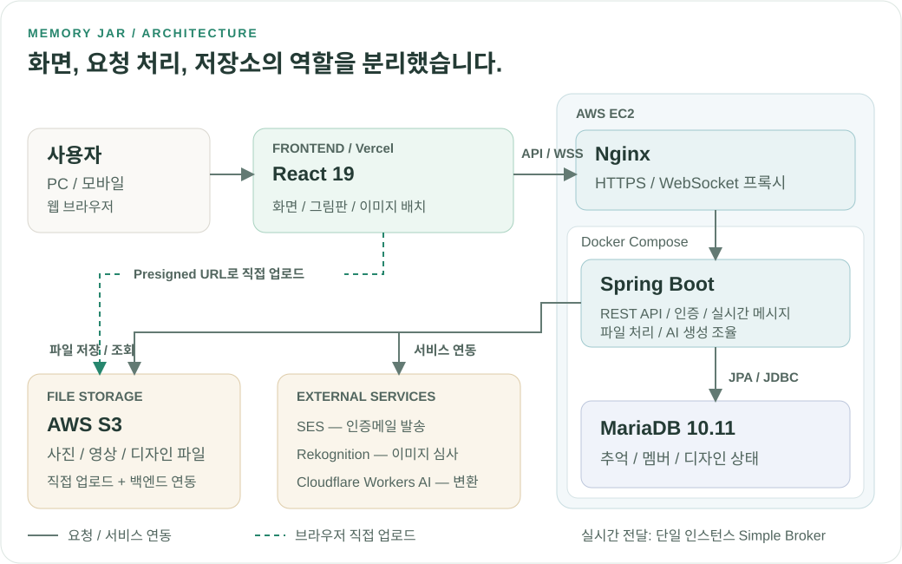
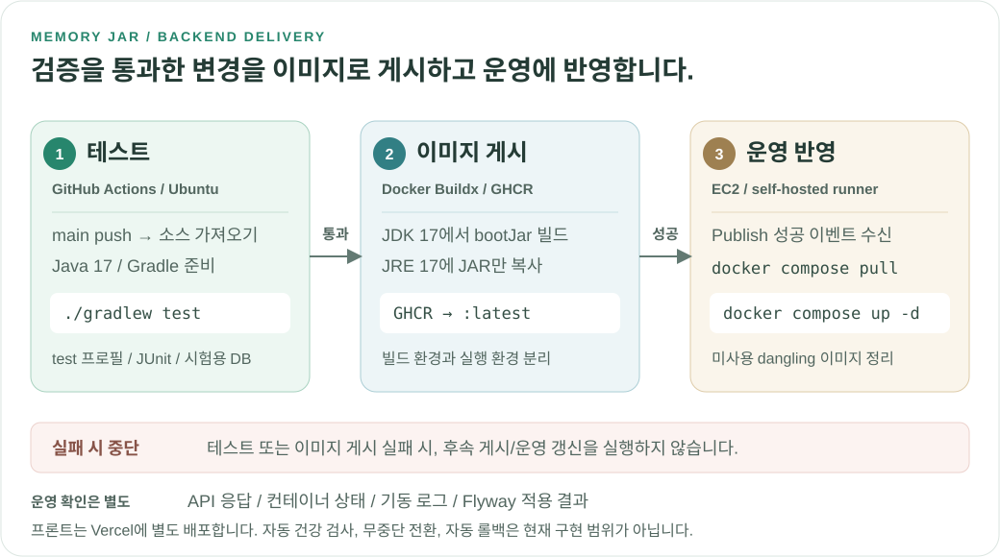

# Memory Jar

**소중한 사람들과 추억을 모으고 약속한 날 함께 열어보는 비공개 추억 공유 서비스**

**개인 프로젝트 | 2026년 2월 ~ 개발 중**

<table align="center">
  <tr>
    <td align="center" width="240">
      <a href="https://www.esjh.shop">
        
        <strong>서비스 둘러보기 →</strong>
      </a>
    </td>
  </tr>
</table>

## 프로젝트 탄생 배경

소중한 사람과 함께 1년 동안 기억하고 싶은 순간들을 종이에 적어 하나의 저금통에 모으는 활동에서 시작한 프로젝트입니다. 서로 떨어져 지내게 되면서 이전처럼 같은 저금통에 추억을 모으기 어려워졌고

> **“멀리 떨어져 있어도 함께 추억을 모을 수 있다면 어떨까?”**

라는 생각에서 Memory Jar를 만들게 되었습니다.

실제 저금통을 온라인으로 옮겨 **장소에 관계없이 함께 추억을 기록하고 정해진 날에 모아둔 기억을 함께 열어볼 수 있는 서비스**를 목표로 합니다. 연인뿐만 아니라 가족, 친구, 동아리 등 소중한 관계를 맺고 있는 사람들도 함께 사용할 수 있도록 확장했습니다.

## 프로젝트 시나리오(사용 순서)

**로그인 → 저금통 만들기 → 소중한 사람 초대 → 추억 모으기 → 약속한 날 열기 → 함께 돌아보기**

1. **로그인하고 시작하기**

   회원가입 또는 소셜 로그인으로 나만의 추억 공간에 들어옵니다.

2. **우리만의 저금통 만들기**

   기본 테마를 고르거나 원하는 외형에 그림과 사진을 담아 직접 꾸밉니다. AI 스타일 변환은 선택 사항이며, 이름과 참여 인원, 함께 열어볼 날짜와 공개 방식을 정합니다.

3. **소중한 사람 초대하기**

   초대 링크나 코드를 전달합니다. 초대받은 사람은 로그인한 뒤 같은 저금통에 참여합니다.

4. **일상의 작은 순간 모으기**

   기억하고 싶은 일을 쪽지에 적고 사진이나 영상을 함께 남깁니다. 정해둔 공개 범위에 따라 오픈 전 추억은 잠겨 있고, 저금통 채팅으로 이야기를 나눌 수 있습니다.

5. **약속한 날 함께 열기**

   오픈 시간이 되면 저금통이 열리고, 그동안 차곡차곡 담아둔 추억을 꺼내 읽을 수 있습니다.

6. **추억을 다시 우리의 이야기로 만들기**

   쪽지를 찾아 읽고 댓글과 리액션으로 마음을 나눕니다. ‘오늘의 추억 한 장’을 뽑아 잊고 있던 순간을 다시 만나볼 수도 있습니다.

## 주요 설계와 문제 해결

**동시 요청, 권한 변경, 외부 서비스 실패, 데이터 증가**처럼 서비스 운영 중 생길 수 있는 문제를 중심으로 개선했습니다.
각 항목은 해결한 문제와 핵심 접근을 먼저 설명하고, 상세 설계와 검증 근거는 펼쳐 볼 수 있도록 정리했습니다.

### 1. 동시 요청에도 데이터 규칙을 지키는 구조

두 사람이 동시에 리액션을 누르거나, 정원을 줄이는 순간 다른 사람이 참여할 수 있습니다.
**같은 데이터를 변경하는 요청이 공통 행 잠금을 사용하도록 맞춰**, 최초 리액션 충돌과 정원 초과를 방지했습니다.

동시성 제어: 문제 상황, 잠금 기준, 실제 DB 검증

- **문제 상황:** 첫 리액션은 아직 잠글 리액션 행이 없습니다. 정원 변경과 초대 참여가 서로 다른 기준으로 검사하면 허용 인원을 넘길 수도 있습니다.
- **설계 선택:** 리액션은 부모 Note, 정원 변경과 참여는 같은 Jar를 먼저 잠급니다. `READ_COMMITTED`로 잠금 대기 후 최신 상태를 읽습니다.
- **기존 동작 유지:** 같은 이모지를 두 번 누르면 취소되는 토글 규칙은 바꾸지 않았습니다.
- **검증 근거:** MariaDB에서 최초 리액션 동시 토글과 정원 축소/초대 참여의 경쟁을 확인했습니다. 정원 경쟁은 6회 반복했습니다.
- **고려할 점:** 같은 부모의 쓰기는 순차 처리합니다. 높은 쓰기 부하에서는 잠금 대기를 추가로 관찰해야 합니다.

[리액션 구현](src/main/java/shop/esjh/memoryjar/service/note/NoteReactionService.java) | [정원 처리](src/main/java/shop/esjh/memoryjar/service/jar/JarService.java) | [동시성 테스트](src/test/java/shop/esjh/memoryjar/service/WriteSafetyIntegrationTest.java)

### 2. 권한이 바뀌면 실시간 메시지 수신도 차단

로그인할 때 권한이 있었더라도, 이후 강퇴나 탈퇴로 접근 권한이 사라질 수 있습니다.
**메시지 전달 직전에도 현재 권한과 세션을 다시 확인**하고, 비밀번호 재설정 전 세션의 접근도 차단하도록 개선했습니다.

보안 설계: 구독 이후 권한 변경과 세션 무효화

- **문제 상황:** WebSocket 연결과 구독이 유지되면, 처음에 통과한 인증만으로는 이후의 권한 변경을 반영하기 어렵습니다.
- **설계 선택:** 전달 직전에 멤버 권한, 토큰 만료, DB 세션 버전을 검사합니다. 비밀번호 재설정 시 Refresh Token을 폐기하고 세션 버전도 변경합니다.
- **검증 근거:** 전달 인터셉터와 세션 유효성은 단위 테스트로, 세션 변경과 채팅 처리의 경쟁은 통합 테스트로 확인했습니다.
- **보장 범위:** 이후 검사에서 메시지 전달을 차단하고 연결 종료를 시도합니다. 이미 전달한 메시지의 회수나 권한 변경과 소켓 종료의 원자적 처리를 보장하지는 않습니다.

[전달 권한 검사](src/main/java/shop/esjh/memoryjar/config/WebSocketDeliveryAuthorizationInterceptor.java) | [세션 검사](src/main/java/shop/esjh/memoryjar/jwt/SessionValidityService.java) | [통합 테스트](src/test/java/shop/esjh/memoryjar/service/SessionAndChatConcurrencyIntegrationTest.java)

### 3. AI 생성 실패 뒤 남은 파일까지 다시 정리

이미지는 S3에 올라갔지만 DB 저장은 실패할 수 있고, 실패한 파일을 삭제하는 요청도 실패할 수 있습니다.
**업로드할 파일의 키와 삭제 완료 이력을 DB에 남겨**, 즉시 삭제하지 못한 파일도 스케줄러가 다시 정리하도록 만들었습니다.

실패 복구: 업로드 예약, 보상 삭제, 정리 재시도

- **문제 상황:** DB와 S3는 하나의 트랜잭션으로 되돌릴 수 없습니다. 업로드, DB 저장, 삭제 중 일부만 성공하면 사용하지 않는 파일이 남을 수 있습니다.
- **설계 선택:** V48에서 업로드 전 예약 키와 삭제 성공 시각을 기록합니다. 느린 외부 I/O는 DB 트랜잭션 밖에서 수행합니다.
- **성공 파일 보호:** 업로드 완료 여부가 불명확하면 삭제를 유예합니다. 삭제 직전에 실패 상태와 예약 키를 다시 확인합니다.
- **작업 격리:** S3 정리 스케줄러를 분리해 느린 정리 작업이 자동 오픈과 세션 검사에 미치는 영향을 줄였습니다.
- **검증 근거와 한계:** 보상 삭제, 재시도, 성공 후보 보호 테스트와 MariaDB V47→V48 업그레이드를 확인했습니다. V48 이전에 이미 잃어버린 파일 키는 자동 복구하지 않습니다.

[생성 처리](src/main/java/shop/esjh/memoryjar/service/ai/JarAiGenerationService.java) | [정리 처리](src/main/java/shop/esjh/memoryjar/service/ai/AiDraftCleanupService.java) | [V48 검증 기록](docs/WRITE_SAFETY_V48.md)

### 4. 댓글이 많고 답글이 깊어져도 이어서 탐색

댓글을 한 번에 모두 읽거나 깊은 답글을 재귀로 처리하면, 데이터가 늘수록 조회와 처리 비용이 커집니다.
**커서 기반 페이지 조회와 반복 처리**를 적용해, 답글 깊이를 제한하지 않으면서 필요한 댓글을 이어서 읽도록 개선했습니다.

조회 최적화: 작성자 동시 조회, 커서 분리, 깊은 답글 처리

- **문제 상황:** 전체 댓글 조회와 작성자별 추가 조회는 DB 부담을 늘립니다. 깊은 재귀 처리는 호출 스택에도 부담을 줍니다.
- **설계 선택:** ID 커서로 댓글을 나눠 읽고 작성자도 함께 조회합니다. 하위 답글 삭제는 재귀 대신 최대 500 ID씩 반복 처리합니다.
- **페이지 누락 방지:** 알림에서 찾은 댓글의 조상 경로를 추가하더라도, 다음 페이지 커서는 일반 조회 결과를 기준으로 계산합니다.
- **검증 근거:** MariaDB에서 1,100단계 답글의 페이지 조회와 삭제, Node 테스트에서 10,000단계 트리 탐색을 확인했습니다.
- **고려할 점:** 답글 깊이에 새 제한은 없습니다. 구 클라이언트용 전체 조회와 매우 깊은 트리의 화면 렌더링 비용은 남아 있습니다.

[댓글 처리](src/main/java/shop/esjh/memoryjar/service/note/NoteCommentService.java) | [프론트 페이지와 트리 처리](frontend/src/features/jarDetail/utils/commentPaging.mjs) | [조회 테스트](src/test/java/shop/esjh/memoryjar/service/WriteSafetyQuerySmokeTest.java)

## 핵심 기능

- **함께 채우는 저금통:** 초대코드 참여, 멤버 역할과 정원 관리, 공개 날짜와 잠금 정책
- **추억 기록과 다시 보기:** 300자 쪽지와 사진, 영상, 목록 조회와 검색, 자동 오픈, 오늘의 추억 한 장
- **실시간 소통:** 채팅, 읽음 위치, 알림, 쪽지 리액션, 댓글, 답글
- **나만의 외형:** 직접 그리기, 이미지 배치, 입구 편집, 6가지 AI 스타일 변환과 후보 비교
- **계정 관리:** 이메일 인증, 자체 로그인, 네이버와 Google 및 카카오 소셜 로그인, 계정 복구

[서비스 기능과 정책 자세히 보기](docs/PROJECT_OVERVIEW.md)

## 기술 스택

### Backend

### Database

### Frontend

### Infrastructure & Cloud

### Test & Performance

## 시스템 구성

사용자 요청은 Nginx를 거쳐 Spring Boot로 전달됩니다.
파일 업로드는 Presigned URL로 S3에 직접 연결하고, 인증메일과 이미지 심사, AI 변환은 백엔드가 외부 서비스와 연동합니다.

[🔎 시스템 구성도 크게 보기](docs/images/system-architecture.svg)

| 구분 | 역할과 연결 방식 |
| --- | --- |
| **화면** | Vercel의 React 화면에서 HTTPS API와 WSS/STOMP로 백엔드에 연결 |
| **요청 처리** | EC2의 Nginx가 Spring Boot로 요청 전달. Spring Boot와 MariaDB는 Docker Compose로 실행 |
| **파일 저장** | 백엔드가 발급한 Presigned URL로 브라우저에서 S3에 직접 업로드. 백엔드도 디자인 파일을 저장하고 조회 |
| **외부 기능** | SES로 인증메일 발송, Rekognition으로 이미지 심사, Cloudflare Workers AI로 스타일 변환 |

실시간 메시지는 현재 **단일 Spring Boot 인스턴스의 Simple Broker**를 사용합니다.
구성도에서 실선은 요청/서비스 연동, 점선은 브라우저의 직접 파일 업로드 경로입니다.

🚢 테스트부터 배포까지의 흐름 보기

**백엔드는 검증과 이미지 게시를 마친 뒤에만 운영 컨테이너를 갱신합니다.**
하나의 흐름을 검증, 이미지 패키징, 운영 반영의 세 단계로 나누었습니다.

[🔎 배포 흐름도 크게 보기](docs/images/deployment-pipeline.svg)

### 1. 테스트를 통과한 변경만 이미지로 게시

`main`에 push하면 GitHub-hosted Ubuntu runner가 소스를 가져오고 Java 17과 Gradle 캐시를 준비합니다.
`./gradlew test`는 `test` 프로필로 실행하며, 단위 테스트뿐 아니라 MariaDB Testcontainers 기반 Repository, 동시성, 마이그레이션 테스트도 포함합니다.

테스트가 실패하면 이후 이미지 빌드와 게시를 진행하지 않습니다.
이 단계는 운영 DB가 아닌 시험용 DB와 설정을 사용하며 프론트 테스트나 브라우저 회귀 테스트는 이 워크플로에 포함되지 않습니다.

### 2. 빌드 환경과 실행 환경을 분리한 Docker 이미지 생성

Buildx를 설정하고 `GITHUB_TOKEN`으로 GHCR에 로그인합니다. Dockerfile은 다음 두 단계로 애플리케이션을 패키징합니다.

| 단계 | 처리 |
| --- | --- |
| Build — JDK 17 | Gradle Wrapper와 소스를 복사한 뒤 `./gradlew --no-daemon clean bootJar`로 실행 가능한 JAR 생성 |
| Runtime — JRE 17 | 빌드 결과 JAR만 복사하고 `java -jar`로 실행. 빌드용 JDK와 소스는 최종 이미지에 포함하지 않음 |

**테스트는 이미지 빌드 이전의 별도 CI 단계에서 실행합니다.** Dockerfile의 `bootJar` 단계가 테스트를 다시 실행하는 것은 아닙니다.
완성한 이미지는 `ghcr.io/dlawhd/graduation:latest`로 게시합니다. 현재 태그는 `latest`이며 배포 워크플로가 특정 커밋 SHA나 이미지 digest를 고정하지는 않습니다.

### 3. 성공한 Publish 작업만 운영 Compose에 반영

`deploy` 워크플로는 이미지 게시 워크플로의 `workflow_run: completed` 이벤트를 받고,
`conclusion == 'success'`인 경우에만 self-hosted runner에서 실행합니다. 빌드나 게시가 실패하거나 취소되면 운영 갱신 작업은 실행하지 않습니다.

운영 배포 디렉터리에서 다음 순서로 처리합니다.

| 명령 | 역할 |
| --- | --- |
| `docker compose -f docker-compose.prod.yml pull` | Compose에 선언된 서비스의 이미지를 가져옴 |
| `docker compose -f docker-compose.prod.yml up -d` | 변경된 이미지를 사용하는 컨테이너를 갱신하고 백그라운드로 실행 |
| `docker image prune -f` | 컨테이너가 사용하지 않는 dangling 이미지를 정리 |

새 API가 기동하면 현재 애플리케이션 설정에 따라 Flyway 마이그레이션과 Hibernate 스키마 검증을 수행합니다.
다만 `up -d` 이후 워크플로가 API 준비 완료까지 기다리거나 HTTP 응답을 확인하는 단계는 없습니다.

같은 `deploy` concurrency 그룹에는 `cancel-in-progress: true`를 적용합니다.
새 배포 작업이 시작되면 이전 실행을 취소하도록 설정하지만, 이미 실행된 명령을 되돌리거나 부분 반영을 복구하는 기능은 아닙니다.

### 자동화 범위와 운영 확인

- **프론트:** Vercel에 별도로 배포합니다. 위 GitHub Actions는 백엔드 테스트와 컨테이너 배포만 담당합니다.
- **운영 확인:** API 응답, 컨테이너 상태, 기동 로그와 Flyway 적용 결과는 별도로 확인해야 합니다. 이 확인은 현재 배포 워크플로의 자동 단계가 아닙니다.
- **현재 한계:** 무중단 전환, 실패 시 자동 롤백, 이미지 digest 고정은 이 워크플로에 구현되어 있지 않습니다. 작업 성공과 서비스 정상 기동은 구분합니다.
- **설정 보호:** 운영 Compose 파일과 인증정보는 저장소에 포함하지 않습니다. 운영 Compose의 상세 건강 검사나 리소스 제한은 이 저장소만으로 확인할 수 없습니다.

[📦 검증과 이미지 게시 워크플로](.github/workflows/publish-ghcr.yml) | [🚢 운영 배포 워크플로](.github/workflows/deploy.yml) | [🐳 다단계 Dockerfile](Dockerfile) | [🧪 로컬 검증 방법](docs/LOCAL_DEVELOPMENT.md#먼저-코드-검증하기)

## 테스트와 검증

테스트 수뿐 아니라 **어떤 문제를 어떤 환경에서 확인했는지**를 함께 기록했습니다.
아래 결과는 기존 검증 기록이며 로컬 자동 테스트와 운영 읽기 부하 시험을 구분합니다.

### 🧪 기능과 데이터 안전성

**2026-10-05 로컬 검증 기록**

| 검증 영역 | 확인한 내용 | 결과 |
| --- | --- | --- |
| **백엔드 자동 테스트** | 비즈니스 규칙, 권한, 예외 처리와 기존 기능 회귀 | **1,683개 통과**, `test bootJar` 성공 |
| **MariaDB 통합 테스트** | 동시 요청 정합성, 깊은 답글, 페이지 커서, V47→V48 업그레이드 | 쓰기 안전성 **4개** + 마이그레이션 **1개** 통과 |
| **프론트 로직 테스트** | 유틸리티의 정상 동작과 예외 상황 | **82개 통과** |
| **브라우저 회귀 테스트** | 댓글 이어보기, 실패 후 재시도, 답글 경로, 300자 제한, 타이머 전환 | **PC 1440px / 모바일 390px** 통과 |

검증 환경, 실행 근거, 확인하지 않은 범위

- **DB 환경:** MariaDB 10.11 Testcontainers로 독립된 시험용 DB를 실행했습니다. 운영과 같은 DB 엔진/주 버전이지만 운영 데이터와 설정을 그대로 복제한 검증은 아닙니다.
- **통합 테스트의 의미:** 단위 테스트의 모의 객체만으로는 확인하기 어려운 실제 DB 잠금과 Flyway 업그레이드를 별도로 검증했습니다. 위 5개 DB 테스트는 백엔드 전체 1,683개에 포함됩니다.
- **백엔드 결과:** JUnit XML 기준 실패, 오류, 건너뜀은 모두 0개입니다.
- **브라우저 환경:** 실제 React 화면에 시험용 REST와 WebSocket 응답을 연결했습니다. 운영 DB, 실제 S3, SES, 유료 AI는 호출하지 않았습니다.
- **빌드 결과:** 프론트 Vite 빌드도 성공했습니다. 기존 대형 JavaScript 청크 경고는 남아 있으며 페이지 단위 지연 로딩은 개선 과제입니다.

[📋 상세 검증 기록](docs/WRITE_SAFETY_V48.md) | [🖥️ 브라우저 테스트](frontend/tests/write-safety.browser.cjs) | [🧪 로컬 검증 방법](docs/LOCAL_DEVELOPMENT.md#먼저-코드-검증하기)

### 📈 운영 API 읽기 부하

**2026-09-30 k6 콘솔 기록** 기준으로, 최대 300명의 가상 사용자가 읽기 요청을 반복하는 시나리오를 실행했습니다.

| 최대 가상 사용자 | 전체 요청 | 요청 실패율 | 응답 시간 p95 |
| --- | --- | --- | --- |
| **300 VU** | **12,813건** | **0%** | **85.01ms** |

**p95는 전체 요청의 95%가 해당 시간 이내에 응답했다는 뜻입니다.**
300 VU는 테스트 안의 가상 사용자 수이며 초당 300건의 요청이나 서로 다른 계정 300명을 의미하지 않습니다.

부하 조건, 추가 지표, 결과 해석

- **부하 패턴:** 30초 상승 → 2분 유지 → 30초 하강. 요청 사이에는 2~5초의 생각 시간을 두었습니다.
- **추가 지표:** 전체 평균 69.92 req/s, 평균 응답 43.03ms, p99 275.10ms입니다. 요청 속도는 상승/하강 구간을 포함한 전체 평균입니다.
- **검증 범위:** 인증 쿠키를 공유하는 GET 시나리오입니다. 쓰기 요청, AI 생성, WebSocket 전체 처리량이나 장시간 혼합 부하로 일반화하지 않습니다.
- **기록 범위:** 공유된 k6 콘솔 결과를 요약했으며 원시 결과 파일은 저장소에 포함되어 있지 않습니다.

[📈 k6 읽기 시나리오](k6/user-journey-read.js)

> **테스트 통과와 운영 환경의 무결함은 구분합니다.** 운영 배포 후에는 API 응답, 컨테이너 상태, 기동 로그와 DB 마이그레이션 결과를 별도로 확인합니다.

## 로컬 실행

**처음 확인할 때는 외부 서비스 설정 없이 백엔드 테스트부터 실행할 수 있습니다.**
JDK 17, Node.js 22.12 이상, DB 통합 테스트용 Docker가 필요합니다.

[설치와 테스트, 전체 서비스 실행 안내](docs/LOCAL_DEVELOPMENT.md) | [프론트 개발 안내](frontend/README.md)

전체 서비스 구동에는 개발 DB와 외부 서비스 자격증명이 별도로 필요합니다. 운영 인증정보는 저장소에 포함하지 않습니다.

## 더 살펴보기

[API](docs/API.md) | [DTO](docs/DTO.md) | [ERD](docs/ERD.md) | [AI 설계](docs/ai/AI_DESIGN_PLAN.md) | [사진 배치](docs/ai/AI_PHOTO_FRAMING.md) | [쓰기 안전성과 V48](docs/WRITE_SAFETY_V48.md)

현재 한계와 다음 개선 방향

- 프론트 대형 청크를 줄이기 위한 페이지와 기능 단위 지연 로딩.
- 단일 인스턴스 Simple Broker의 다중 서버 확장. Redis와 Kubernetes는 현재 운영 스택이 아닙니다.
- 구 댓글 전체 조회, 깊은 답글 렌더링, 높은 쓰기 부하의 잠금 대기 관찰.
- V48 이전 고아 파일의 S3와 DB 대조. 여러 계정, 대량 데이터, 장시간 혼합 부하 검증.

문서에는 설계 당시의 계획과 이후 증분이 함께 있습니다. 현재 구현은 실제 코드를 기준으로 확인합니다.

