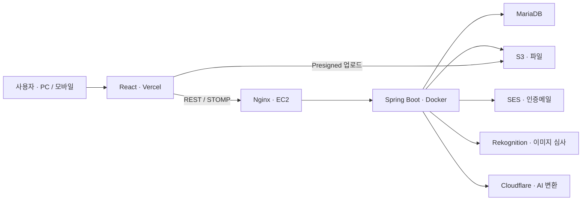

# Memory Jar

**소중한 사람들과 추억을 모으고, 약속한 날 함께 열어보는 비공개 추억 공유 서비스**

[서비스 바로가기](https://www.esjh.shop) · [주요 설계](#주요-설계와-문제-해결) · [검증 결과](#테스트와-검증) · [실행 방법](#로컬-실행)

## 어떤 프로젝트인가요?

종이에 추억을 적어 같은 저금통에 모으던 경험을, **멀리 떨어져 있어도 함께할 수 있는 웹서비스**로 옮겼습니다.
초대받은 사람끼리 글·사진·영상을 모으고, 약속한 날 열어보며 당시의 이야기를 나눕니다.

**개인 프로젝트 · 2026년 2월 ~ 개발 중 · 임종현([dlawhd](https://github.com/dlawhd))**

백엔드·프론트엔드 개발부터 DB 설계, 테스트, 배포 구성까지 직접 담당합니다.

## 주요 설계와 문제 해결

### 1. 행 잠금으로 최초 리액션·정원 변경의 동시 요청 정합성 보호

리액션이 아직 없는 경우도 **부모 Note를 공통 잠금 기준**으로 사용합니다.
초대 참여와 정원 변경은 같은 Jar를 잠가, 동시에 실행되어도 변경된 정원을 초과하지 않도록 처리했습니다.

문제 · 설계 선택 · MariaDB 검증 보기

- **문제:** 첫 리액션에는 잠글 행이 없고, 초대 참여와 정원 변경을 따로 검사하면 인원 제한을 어길 수 있습니다.
- **설계:** 부모 행 잠금과 `READ_COMMITTED`로 최신 상태를 확인합니다. 같은 이모지를 다시 누르면 취소되는 기존 토글 규칙은 유지합니다.
- **검증:** 실제 MariaDB에서 최초 리액션 동시 토글과 정원 축소·참여 경쟁을 확인했습니다. 정원 경쟁은 6회 실행했습니다.
- **트레이드오프:** 같은 부모의 쓰기는 순차 처리하므로 높은 쓰기 부하에서는 잠금 대기를 관찰해야 합니다.

[리액션 구현](src/main/java/shop/esjh/memoryjar/service/note/NoteReactionService.java) · [정원 처리](src/main/java/shop/esjh/memoryjar/service/jar/JarService.java) · [동시성 테스트](src/test/java/shop/esjh/memoryjar/service/WriteSafetyIntegrationTest.java)

### 2. 실시간 메시지 전달 직전 권한·세션 재검사

로그인·구독할 때만 확인하지 않고, **메시지를 전달하는 순간에도 현재 권한을 검사**합니다.
강퇴·탈퇴 이후의 수신과 비밀번호 재설정 이전 세션의 접근을 차단하도록 개선했습니다.

인증 이후에도 권한을 확인하는 구조 보기

- **문제:** 구독 당시 유효했던 권한도 이후 강퇴·탈퇴·비밀번호 재설정으로 달라질 수 있습니다.
- **설계:** 전달 직전에 멤버 권한·토큰 만료·DB 세션 버전을 확인합니다. 비밀번호 재설정은 Refresh Token 폐기와 세션 버전 변경을 함께 처리합니다.
- **검증:** 전달 인터셉터·세션 유효성 단위 테스트와 세션·채팅 경쟁 통합 테스트를 구성했습니다.
- **범위:** 이후 검사에서 전달을 차단하고 연결 종료를 시도합니다. 이미 전달된 메시지의 회수나 권한 변경과 소켓 종료의 원자적 동시 처리를 보장하지는 않습니다.

[전달 권한 검사](src/main/java/shop/esjh/memoryjar/config/WebSocketDeliveryAuthorizationInterceptor.java) · [세션 검사](src/main/java/shop/esjh/memoryjar/jwt/SessionValidityService.java) · [통합 테스트](src/test/java/shop/esjh/memoryjar/service/SessionAndChatConcurrencyIntegrationTest.java)

### 3. DB·S3 부분 실패에도 재시도 가능한 AI 파일 정리

AI 이미지 업로드와 DB 저장이 서로 다른 시점에 실패할 수 있음을 고려했습니다.
**업로드 예약 키와 삭제 완료 이력**을 남겨, 보상 삭제가 실패해도 스케줄러가 다시 정리할 수 있도록 설계했습니다.

외부 서비스 실패와 복구 흐름 보기

- **문제:** DB와 S3를 하나의 트랜잭션으로 되돌릴 수 없어 업로드·DB 저장·삭제 중 일부만 성공하면 파일이 남을 수 있습니다.
- **설계:** V48에서 업로드 전 예약 키를 기록하고 삭제 성공 시각을 별도 관리합니다. 외부 I/O는 DB 트랜잭션 밖에서 수행합니다.
- **보호:** 업로드 완료 여부가 모호하면 유예하고, 삭제 직전 상태·키를 재검사해 성공 후보를 보호합니다. S3 정리는 자동 오픈·세션 검사와 다른 스케줄러에서 실행합니다.
- **검증:** 보상 삭제·재시도·성공 후보 보호 테스트와 MariaDB V47→V48 업그레이드를 확인했습니다. V48 이전에 이미 잃어버린 키는 자동 복구하지 않습니다.

[생성 처리](src/main/java/shop/esjh/memoryjar/service/ai/JarAiGenerationService.java) · [정리 처리](src/main/java/shop/esjh/memoryjar/service/ai/AiDraftCleanupService.java) · [V48 검증 기록](docs/WRITE_SAFETY_V48.md)

### 4. 깊은 답글을 유지하면서 댓글 조회·삭제 비용 개선

댓글은 **작성자를 함께 읽는 커서 페이지 조회**, 깊은 답글은 **재귀 대신 반복 처리**로 변경했습니다.
알림 대상의 조상 경로를 추가해도 페이지 커서가 건너뛰지 않도록 분리했습니다.

조회 최적화 · 깊은 답글 검증 보기

- **문제:** 전체 댓글 조회·작성자 지연 조회와 깊은 재귀 처리는 데이터가 늘수록 비용과 호출 스택 부담이 커집니다.
- **설계:** ID 커서와 작성자 동시 조회를 사용합니다. 일반 페이지 커서는 알림 대상 경로와 분리하고, 하위 답글 삭제는 최대 500 ID씩 반복 처리합니다.
- **검증:** MariaDB에서 1,100단계 답글의 페이지 조회·삭제, Node 테스트에서 10,000단계 트리 탐색을 확인했습니다.
- **범위:** 답글 깊이에 새 제한을 두지 않습니다. 구 클라이언트용 전체 조회와 매우 깊은 화면 렌더링 비용은 남아 있습니다.

[댓글 처리](src/main/java/shop/esjh/memoryjar/service/note/NoteCommentService.java) · [프론트 페이지·트리 처리](frontend/src/features/jarDetail/utils/commentPaging.mjs) · [조회 테스트](src/test/java/shop/esjh/memoryjar/service/WriteSafetyQuerySmokeTest.java)

## 핵심 기능

- **함께 채우는 저금통:** 초대코드 참여, 멤버 역할·정원 관리, 공개 날짜와 잠금 정책.
- **추억 기록과 다시 보기:** 300자 쪽지·사진·영상, 목록·검색, 자동 오픈, 오늘의 추억 한 장.
- **실시간 소통:** 채팅·읽음 위치·알림, 쪽지 리액션·댓글·답글.
- **나만의 외형:** 직접 그리기·이미지 배치·입구 편집, 6가지 AI 스타일 변환과 후보 비교.
- **계정 관리:** 이메일 인증, 자체·네이버·Google·카카오 로그인, 계정 복구.

[서비스 기능과 정책 자세히 보기](docs/PROJECT_OVERVIEW.md)

## 기술 스택

| 영역 | 주요 기술 |
| --- | --- |
| Backend | Java 17 · Spring Boot 3.5 · Spring Data JPA · Bean Validation |
| Security | Spring Security · OAuth2 · JWT · Argon2id |
| Database | MariaDB 10.11 · Hibernate · Flyway |
| Realtime | Spring WebSocket · STOMP |
| Frontend | React 19 · Vite 8 · Tailwind CSS 4 · Canvas · Framer Motion |
| Cloud & AI | AWS S3 · SES · Rekognition · Cloudflare Workers AI |
| Delivery | EC2 · Nginx · Docker Compose · GHCR · GitHub Actions · Vercel |
| Test | JUnit 5 · Mockito · Testcontainers · H2 · Node.js Test Runner · Playwright · k6 |

## 시스템 구성

백엔드 테스트 통과 후 Docker 이미지를 GHCR에 게시하고, 성공한 워크플로에 한해 운영 Compose를 갱신합니다.
프론트는 Vercel에 별도로 배포합니다. [이미지 게시](.github/workflows/publish-ghcr.yml) · [배포](.github/workflows/deploy.yml)

## 테스트와 검증

**기능 구현뿐 아니라 실제 DB 동시성·마이그레이션·PC/모바일 동작까지 검증했습니다.**

| 검증 | 기록 |
| --- | --- |
| 백엔드 | 전체 테스트 **1,683개 통과** · `test bootJar` 성공 |
| 실제 MariaDB | 쓰기 안전성 4개 · V47→V48 업그레이드 1개 통과 |
| 프론트 | 유틸리티 테스트 **82개 통과** · PC 1440px / 모바일 390px 회귀 통과 |
| 읽기 부하 | 최대 **300 VU** · 요청 실패율 **0%** · **p95 85.01ms** |

측정 조건과 검증 범위 보기

- **로컬 검증:** 2026-10-05, 기준 커밋 `8c3b603`. 백엔드 실패·오류·건너뜀 0개. MariaDB 10.11 Testcontainers를 사용했으며 운영 데이터·설정을 그대로 재현한 것은 아닙니다.
- **브라우저 검증:** 실제 React 화면에 시험용 REST·WebSocket 응답을 연결했습니다. 이 검증에서는 운영 DB·실제 S3·SES·유료 AI를 호출하지 않았습니다.
- **읽기 부하:** 2026-09-30 공유된 k6 콘솔 기록. 30초 상승 → 2분 유지 → 30초 하강, 요청 사이 2~5초 생각 시간. 12,813건, 전체 평균 69.92 req/s, 평균 43.03ms / p99 275.10ms.
- **해석:** 300 VU는 300 RPS나 서로 다른 계정 300명이 아닙니다. 인증 쿠키를 공유하는 GET 시나리오이며 쓰기·AI·WebSocket 전체 처리량으로 일반화하지 않습니다. 원시 결과 파일은 저장소에 포함되어 있지 않습니다.
- **빌드:** 프론트 Vite 빌드는 성공했지만 기존 대형 JavaScript 청크 경고는 남아 있습니다. 테스트 통과가 운영 환경의 무결함을 의미하지는 않습니다.

[상세 검증 기록](docs/WRITE_SAFETY_V48.md) · [브라우저 테스트](frontend/tests/write-safety.browser.cjs) · [k6 시나리오](k6/user-journey-read.js)

## 로컬 실행

**처음 확인할 때는 외부 서비스 설정 없이 백엔드 테스트부터 실행할 수 있습니다.**
JDK 17, Node.js 22.12 이상, DB 통합 테스트용 Docker가 필요합니다.

[설치·테스트·전체 서비스 실행 안내](docs/LOCAL_DEVELOPMENT.md) · [프론트 개발 안내](frontend/README.md)

전체 서비스 구동에는 개발 DB와 외부 서비스 자격증명이 별도로 필요합니다. 운영 인증정보는 저장소에 포함하지 않습니다.

## 더 살펴보기

[API](docs/API.md) · [DTO](docs/DTO.md) · [ERD](docs/ERD.md) · [AI 설계](docs/ai/AI_DESIGN_PLAN.md) · [사진 배치](docs/ai/AI_PHOTO_FRAMING.md) · [쓰기 안전성·V48](docs/WRITE_SAFETY_V48.md)

현재 한계와 다음 개선 방향

- 프론트 대형 청크를 줄이기 위한 페이지·기능 단위 지연 로딩.
- 단일 인스턴스 Simple Broker의 다중 서버 확장. Redis·Kubernetes는 현재 운영 스택이 아닙니다.
- 구 댓글 전체 조회·깊은 답글 렌더링과 높은 쓰기 부하의 잠금 대기 관찰.
- V48 이전 고아 파일의 S3·DB 대조와 여러 계정·대량 데이터·장시간 혼합 부하 검증.

문서에는 설계 당시의 계획과 이후 증분이 함께 있습니다. 현재 구현은 실제 코드를 기준으로 확인합니다.

