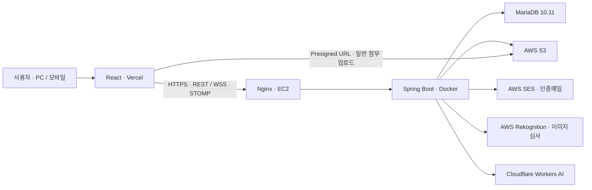

<div align="center">


# Memory Jar

**소중한 사람들과 추억을 모으고, 약속한 날 함께 열어보는 비공개 추억 공유 서비스**

[서비스 바로가기](https://www.esjh.shop) · [주요 설계](#주요-설계와-문제-해결) · [검증 결과](#테스트와-검증) · [실행 방법](#로컬-실행)


</div>

## 프로젝트 정보

| 항목 | 내용 |
| --- | --- |
| 개발 형태 | 개인 프로젝트 |
| 개발 기간 | 2026년 2월 ~ 현재 개발 중 |
| 개발자 | 임종현 · [dlawhd](https://github.com/dlawhd) |
| 개발 범위 | Spring Boot 백엔드, React 프론트엔드, DB 설계, 테스트 및 배포 구성 |
| 서비스 | [www.esjh.shop](https://www.esjh.shop) |

### 이 프로젝트에서 중점적으로 다룬 경험

- **데이터 정합성:** 최초 리액션 토글, 정원 변경과 초대 참여가 동시에 발생하는 경로를 공통 행 잠금으로 보호하고 실제 MariaDB에서 검증했습니다.
- **인증 이후의 보안:** 실시간 구독의 메시지 전달 시점에도 멤버 권한과 세션 유효성을 확인하도록 구성했습니다.
- **외부 서비스 실패와 복구:** AI 생성 상태와 S3 업로드 예약·삭제 이력을 분리해 보상 삭제 실패도 재시도할 수 있도록 개선했습니다.
- **검증과 운영 진단:** 단위·DB 통합·브라우저 회귀 테스트와 읽기 부하 테스트로 변경 결과를 확인했습니다.

## 개발 배경

소중한 사람과 일정 기간 동안 재미있었던 일과 추억을 종이에 적어 같은 저금통에 모았습니다. 서로 떨어져 지내게 된 뒤에도 이 경험을 이어가고 싶었습니다.

Memory Jar는 **서로 다른 장소에서도 하나의 저금통을 함께 채우고, 정해진 날 다시 열어보는 경험**을 웹으로 옮긴 서비스입니다. 연인뿐 아니라 가족, 친구, 동아리도 초대받은 사람들끼리 추억을 보관할 수 있습니다.

## 핵심 기능

| 기능 | 제공하는 경험 |
| --- | --- |
| 계정과 인증 | 이메일 인증 기반 자체 회원가입·로그인, 네이버·Google·카카오 OAuth2 로그인, 계정 복구 |
| 저금통과 멤버 | 저금통 생성, 초대코드 참여, OWNER·ADMIN·MEMBER 역할, 정원·오픈 날짜·공개 정책 관리 |
| 추억 쪽지 | 최대 300자 본문 작성, 사진·영상 첨부, 목록 페이지 탐색, 제목·본문·장소·태그 검색 |
| 약속한 날의 오픈 | 오픈 전 잠금 수준에 따른 조회 제한, 자동 오픈과 조회 시 보정, 함께 열어보는 연출 |
| 오늘의 추억 한 장 | 저금통 단위로 하루 한 장 선정, 같은 날 동일한 결과 공유, 이전 뽑기 기록 탐색 |
| 실시간 소통 | 저금통 채팅, 읽음 위치·미읽음 개수, 인앱 알림, 쪽지 리액션·댓글·답글 |
| 나만의 디자인 | 기본 테마 또는 커스텀 외형 선택, 직접 그리기·이미지 불러오기, 사진 배치·전체 보기, 입구 위치와 모양 편집 |
| AI 스타일 변환 | 귀여운 2D·부드러운 3D·수채화·손그림·기괴·픽셀 후보 생성, 원본과 비교 후 최종 선택 |

커스텀 제작은 **외형 선택 → 그림 또는 이미지 준비 → 외형 안의 사진 배치 → 선택적 AI 변환 → 입구 편집 → 저금통 생성**으로 이어집니다. 외형 없이 이미지만 사용할 수도 있으며, 기존 기본 저금통 생성 흐름도 유지합니다.

> 쪽지 본문 300자는 Java·JavaScript의 UTF-16 길이 기준이며, 기존 긴 쪽지를 잘라내지는 않습니다. `DAILY_DRAW`는 하루 한 장을 뽑는 경험을 중심으로 하는 오픈 방식입니다. 현재 구현에서 오픈 이후 전체 쪽지 조회를 하루 한 장으로 제한하지는 않습니다.

## 기술 스택

| 영역 | 기술 | 사용 목적 |
| --- | --- | --- |
| Backend | Java 17, Spring Boot 3.5.10, Spring MVC, Bean Validation | REST API, 요청 검증, 서비스 규칙과 트랜잭션 |
| Security | Spring Security, OAuth2, JWT, Argon2id | 인증·인가, 쿠키 기반 로그인, 세션 폐기, 비밀번호 해시 |
| Database | MariaDB 10.11, Spring Data JPA, Hibernate, Flyway | 영속성, 조회 최적화, 행 잠금·제약조건, 스키마 이력 |
| Realtime | Spring WebSocket, STOMP | 채팅·알림·오픈·디자인 생성 이벤트 |
| Frontend | React 19, JavaScript, React Router, Vite 8, Tailwind CSS 4 | 반응형 UI, 라우팅, 상태·오류 처리, 빌드 |
| Interaction | HTML Canvas, Framer Motion | 그림판, 이미지 조정, 쪽지 투입과 저금통 연출 |
| Cloud & AI | AWS S3, SES, Rekognition, Cloudflare Workers AI | 파일 저장, 인증메일, 이미지 콘텐츠 심사, AI 변환 |
| Delivery | AWS EC2, Nginx, Docker Compose, GHCR, GitHub Actions, Vercel | 백엔드 컨테이너 운영·자동 배포, 프론트 호스팅 |
| Verification | JUnit 5, Mockito, Testcontainers, H2, Node.js Test Runner, Playwright, k6 | 단위·DB 통합·브라우저 회귀·부하 검증 |

Redis와 Kubernetes는 현재 운영 스택으로 사용하지 않습니다. 실시간 이벤트는 단일 Spring Boot 인스턴스의 Simple Broker를 사용하며, 여러 API 인스턴스 간 메시지 전달은 별도 확장 과제입니다.

## 시스템 구성



- Controller는 요청 검증과 서비스 호출, Service는 정책·권한·트랜잭션, Repository는 조회와 잠금을 담당합니다.
- Entity를 그대로 반환하지 않고 DTO로 필요한 정보를 전달합니다. JPA의 Open Session in View는 비활성화하고, Flyway 적용 후 Hibernate는 스키마를 검증합니다.
- 일반 첨부파일은 Presigned URL로 업로드합니다. AI 디자인은 생성 전 Draft에서 원본·후보·선택 상태를 관리하고, 최종 선택을 별도의 Jar 디자인으로 확정합니다.
- AI 생성의 상태 변경은 짧은 DB 트랜잭션에서, Cloudflare·S3·심사 작업은 그 밖에서 수행합니다.

## 주요 설계와 문제 해결

### 1. 최초 리액션과 정원 변경의 동시 요청

**문제:** 첫 리액션은 아직 행이 없으므로 리액션 행만 잠글 수 없습니다. 초대 참여와 정원 변경이 서로 다른 기준으로 검사하면 변경된 정원보다 멤버가 많아질 수 있습니다.

**대응:** 리액션 쓰기는 항상 존재하는 부모 Note를 먼저 잠그고 최신 리액션을 확인합니다. 초대 참여와 정원 변경은 같은 Jar 행을 잠그며, `READ_COMMITTED`에서 최신 인원과 설정을 검사합니다. 리액션의 기존 토글 의미는 유지합니다.

**검증:** 같은 이모지의 최초 동시 요청 두 건을 저장 후 취소로 처리하고, 정원 축소·참여 경쟁을 6회 실행해 정원 초과가 없음을 확인했습니다. 이 방식은 같은 부모의 쓰기를 순차 처리하므로, 높은 쓰기 부하에서는 잠금 대기 시간을 함께 관찰해야 합니다.

[구현](src/main/java/shop/esjh/memoryjar/service/note/NoteReactionService.java) · [정원 처리](src/main/java/shop/esjh/memoryjar/service/jar/JarService.java) · [MariaDB 동시성 테스트](src/test/java/shop/esjh/memoryjar/service/WriteSafetyIntegrationTest.java)

### 2. 실시간 구독 이후에도 달라지는 권한과 세션

**문제:** 연결·구독 당시 권한이 유효해도 이후 강퇴·탈퇴하거나 비밀번호를 재설정할 수 있습니다. 이미 구독했다는 이유만으로 계속 메시지를 전달해서는 안 됩니다.

**대응:** 메시지 전달 직전에 현재 멤버 권한, 토큰 만료와 DB 세션 버전을 검사합니다. 비밀번호 재설정 시 기존 Refresh Token을 폐기하고 세션 버전을 변경하여 이전 Access Token도 이후 요청·전달 검사에서 차단합니다. 검사를 통과하지 못한 소켓은 메시지 전달을 막고 연결 종료를 시도합니다.

**검증:** 전달 인터셉터·세션 유효성 단위 테스트와 세션·채팅 경쟁 통합 테스트를 구성했습니다. 이미 전달된 메시지를 회수하거나 권한 변경과 소켓 종료가 원자적으로 동시에 일어난다는 의미는 아닙니다.

[전달 시점 권한 검사](src/main/java/shop/esjh/memoryjar/config/WebSocketDeliveryAuthorizationInterceptor.java) · [세션 검사](src/main/java/shop/esjh/memoryjar/jwt/SessionValidityService.java) · [통합 테스트](src/test/java/shop/esjh/memoryjar/service/SessionAndChatConcurrencyIntegrationTest.java)

### 3. 실패한 AI 후보 파일을 다시 정리할 수 있는 구조

**문제:** DB와 S3는 하나의 트랜잭션으로 함께 되돌릴 수 없습니다. 업로드 후 DB 처리가 실패하거나 보상 삭제가 실패하면 파일이 남을 수 있습니다.

**대응:** V48에서 업로드 전에 예약 키를 기록하고, 실패 후보의 삭제 완료 시각을 별도로 관리합니다. 삭제가 실패해도 키를 잃지 않아 정리 스케줄러가 재시도할 수 있습니다. 업로드 완료 여부가 모호한 경우 유예를 두고, 삭제 직전에 상태와 키를 다시 확인해 성공 후보를 보호합니다. 느린 S3 정리는 자동 오픈·세션 검사와 다른 스케줄러에서 실행합니다.

**검증:** 보상 삭제·재시도·성공 후보 보호 테스트와 실제 MariaDB의 V47→V48 업그레이드 테스트를 통과했습니다. 이전에 이미 잃어버린 키를 자동으로 복구하는 기능은 포함하지 않습니다.

[생성 처리](src/main/java/shop/esjh/memoryjar/service/ai/JarAiGenerationService.java) · [정리 처리](src/main/java/shop/esjh/memoryjar/service/ai/AiDraftCleanupService.java) · [V48 계약과 검증](docs/WRITE_SAFETY_V48.md)

### 4. 깊은 답글을 유지하면서 조회·삭제 비용을 줄이기

**문제:** 댓글 전체 조회와 작성자 지연 조회는 데이터가 커질수록 부담이 됩니다. 깊은 답글을 재귀로 처리하면 호출 스택 제한에도 영향을 받습니다.

**대응:** 새 화면은 ID 커서 기반 페이지를 사용하고 작성자를 함께 조회합니다. 알림 대상의 조상 경로를 추가하더라도 일반 페이지 커서를 유지해 중간 댓글을 건너뛰지 않습니다. 하위 답글 삭제와 트리 조립은 반복 처리하고, 삭제는 최대 500 ID씩 나눕니다. 답글 깊이에 새로운 제한을 두지 않습니다.

**검증:** MariaDB에서 1,100단계 답글의 페이지 조회·삭제, Node 테스트에서 10,000단계 트리의 개수·경로 탐색을 확인했습니다. 구 클라이언트용 전체 조회 API와 아주 깊은 답글의 화면 렌더링 비용은 여전히 고려해야 합니다.

[댓글 처리](src/main/java/shop/esjh/memoryjar/service/note/NoteCommentService.java) · [프론트 페이지·트리 처리](frontend/src/features/jarDetail/utils/commentPaging.mjs) · [조회 검증](src/test/java/shop/esjh/memoryjar/service/WriteSafetyQuerySmokeTest.java)

## 테스트와 검증

**2026-10-05 · 기준 커밋 `8c3b603`의 로컬 검증 기록**입니다. 테스트 수는 코드 커버리지나 운영 환경의 무결함을 의미하지 않습니다.

| 검증 | 결과와 범위 |
| --- | --- |
| 백엔드 전체 테스트 | 1,683개 통과, 실패·오류·건너뜀 0개. `test bootJar` 성공 |
| MariaDB 쓰기 안전성 | MariaDB 10.11 Testcontainers에서 리액션·정원 경쟁·깊은 답글·커서 경로 테스트 4개 통과 |
| V47→V48 업그레이드 | 기존 FAILED 데이터 보존, 예약 키·삭제 기록, 인덱스·기존 CHECK 제약 테스트 1개 통과 |
| 프론트 유틸리티 | Node.js 테스트 82개 통과. 이미지 배치·입구 좌표·오류 분류·댓글 등 검증 |
| PC·모바일 브라우저 | 1440px·390px에서 댓글 이어보기·재시도·답글 경로·작성·300자 제한·입자 타이머 전환 통과 |
| 프론트 빌드 | Vite 빌드 성공. 대형 JavaScript 청크 경고는 남아 있음 |

MariaDB 통합 테스트는 운영과 같은 DB 엔진·주 버전을 사용하지만 운영 데이터·설정·부하를 그대로 재현한 것은 아닙니다. 브라우저 회귀 테스트는 실제 React 화면에 시험용 REST·WebSocket 응답을 연결하고 외부 요청을 차단합니다. 이 검증에서 실제 S3·SES·유료 AI를 호출하거나 운영 DB를 변경하지 않았습니다.

[상세 검증 기록](docs/WRITE_SAFETY_V48.md) · [브라우저 회귀 스크립트](frontend/tests/write-safety.browser.cjs)

### 읽기 부하 테스트

2026-09-30 공유된 k6 콘솔 기록 기준입니다. 원시 결과 파일은 현재 저장소에 포함되어 있지 않습니다.

| 조건·지표 | 관측값 |
| --- | --- |
| 시나리오 | 최대 300 VU, 30초 상승 → 2분 유지 → 30초 하강, 요청 사이 2~5초 생각 시간 |
| 대상 | 저금통·쪽지·멤버·알림·채팅 조회 GET API |
| HTTP 요청 | 12,813건 / 전체 실행 평균 약 69.92 req/s |
| 요청 실패율 | 0% |
| 응답 시간 | 평균 43.03ms / p95 85.01ms / p99 275.10ms |

**300 VU는 300 RPS나 서로 다른 계정 300명과 같은 의미가 아닙니다.** 해당 스크립트는 인증 쿠키를 공유하는 읽기 시나리오이며 쓰기·AI 생성·WebSocket 전체 부하의 결과로 일반화하지 않습니다. 장시간 지속 부하, 여러 계정·대량 데이터 및 동일 조건 반복 측정은 별도 검증이 필요합니다.

[사용자 여정 스크립트](k6/user-journey-read.js) · [인증값을 숨겨 입력하는 실행 도우미](k6/run-user-journey-read.ps1)

## 빌드와 배포

```text
main push
  → GitHub Actions: 백엔드 테스트
  → Docker 다단계 빌드 → GHCR 이미지 게시
  → 성공한 워크플로에 한해 self-hosted runner 실행
  → 운영 Docker Compose의 이미지 pull / 컨테이너 갱신
```

- [이미지 게시](.github/workflows/publish-ghcr.yml)와 [백엔드 배포](.github/workflows/deploy.yml)를 분리합니다. 프론트는 Vercel에 배포하며, 위 워크플로가 프론트 테스트·배포까지 수행하지는 않습니다.
- DB는 신규 Flyway 마이그레이션으로 변경합니다. 기존 적용 파일을 수정하지 않으며, API 계약 변경 시 백엔드·DB를 먼저 배포하고 호환되는 프론트를 뒤에 배포합니다.
- 운영용 `docker-compose.prod.yml`과 인증정보는 저장소에 포함되어 있지 않습니다. 워크플로 정의는 최근 배포 성공이나 무중단·자동 롤백을 보장하는 기록이 아닙니다.

## 로컬 실행

### 준비

- JDK 17과 Gradle Wrapper. Gradle을 별도 설치할 필요는 없습니다.
- Node.js 22.12 이상과 npm. Vite·React 플러그인의 요구 범위는 `^20.19.0 || >=22.12.0`입니다.
- 실행 중인 Docker 엔진: MariaDB Testcontainers 통합 테스트에 필요합니다.
- 전체 서비스 구동에는 별도의 MariaDB 10.11 개발 DB와 외부 서비스 설정이 필요합니다. **백엔드 테스트는 운영 인증정보 없이 실행할 수 있습니다.**

```bash
git clone https://github.com/dlawhd/graduation.git
cd graduation
```

### 먼저 코드 검증하기

프로젝트 루트에서 실행합니다. 테스트는 기본으로 `test` 프로필을 사용하고, 통합 테스트용 MariaDB는 Testcontainers가 준비합니다. 최초 실행은 의존성·Docker 이미지 다운로드에 시간이 걸릴 수 있습니다.

```powershell
# Windows PowerShell
.\gradlew.bat test bootJar --console=plain

# MariaDB 동시 요청과 V48 업그레이드만 선택 실행
.\gradlew.bat test --tests '*WriteSafetyIntegrationTest' --tests '*AiCandidateCleanupV48MigrationTest' --console=plain
```

Linux·macOS에서는 `./gradlew test bootJar --console=plain`을 사용합니다. 백엔드 테스트 보고서는 실행 후 `build/reports/tests/test/index.html`에서 확인할 수 있습니다.

```powershell
# 프론트 검증 · Windows PowerShell
cd frontend
npm ci
$testFiles = @(Get-ChildItem src -Recurse -Filter '*.test.mjs' | ForEach-Object { $_.FullName })
node --test $testFiles
npm run build
```

Linux·macOS 프론트 테스트 명령은 `node --test src/features/jarDesign/*.test.mjs src/features/jarDetail/utils/*.test.mjs`입니다. 빌드 출력은 `frontend/dist`입니다. `npm test`·`npm start`는 현재 scripts에 없습니다.

브라우저 테스트는 별도의 Playwright 모듈과 Google Chrome이 필요합니다. 현재 `frontend/package.json`에 Playwright가 선언되어 있지 않으므로 `npm ci`만으로는 실행되지 않습니다. 스크립트는 `PLAYWRIGHT_MODULE`로 모듈 경로를, `TEST_BASE_URL`로 로컬 Vite 주소를, `TEST_VIEWPORT_WIDTH`로 화면 너비를 지정할 수 있습니다. 테스트 HTML은 `frontend/tests`에 있으며 운영 라우트가 아닙니다.

<details>
<summary><strong>전체 서비스 구동을 위한 설정과 실행</strong></summary>

개발 전용 DB·계정을 먼저 준비합니다. 로컬 `compose.yaml`과 `application-local.yml`은 Git에서 제외되어 있어 새 clone에 포함되지 않습니다. 아래 환경변수는 **자신의 개발 환경 값**으로 준비하며 운영 DB를 연결하지 않습니다.

| 설정 | 용도 |
| --- | --- |
| `SPRING_DATASOURCE_URL` | 개발 DB JDBC URL. 예: `jdbc:mariadb://localhost:3308/memoryjar_dev` — 실제 생성한 DB·포트 사용 |
| `SPRING_DATASOURCE_USERNAME`, `SPRING_DATASOURCE_PASSWORD` | 개발 DB 계정 |
| `APP_JWT_SECRET` | 충분한 길이의 별도 무작위 JWT 서명 키, UTF-8 최소 32바이트 |
| `APP_EMAIL_VERIFICATION_SECRET` | JWT 키와 구분한 이메일 인증용 비밀값 |
| `SPRING_SECURITY_OAUTH2_CLIENT_REGISTRATION_NAVER_CLIENT_ID`, `SPRING_SECURITY_OAUTH2_CLIENT_REGISTRATION_NAVER_CLIENT_SECRET` | 네이버 OAuth2 등록 정보 |
| `SPRING_SECURITY_OAUTH2_CLIENT_REGISTRATION_GOOGLE_CLIENT_ID`, `SPRING_SECURITY_OAUTH2_CLIENT_REGISTRATION_GOOGLE_CLIENT_SECRET` | Google OAuth2 등록 정보 |
| `SPRING_SECURITY_OAUTH2_CLIENT_REGISTRATION_KAKAO_CLIENT_ID`, `SPRING_SECURITY_OAUTH2_CLIENT_REGISTRATION_KAKAO_CLIENT_SECRET` | 카카오 OAuth2 등록 정보 |
| `APP_S3_REGION`, `APP_S3_BUCKET`, `APP_S3_PUBLIC_BASE_URL` | 개발 S3 파일 저장·조회 설정 |
| `APP_SES_REGION`, `APP_SES_FROM_EMAIL` | SES 리전과 인증된 발신 주소 |
| `APP_AI_CLOUDFLARE_ACCOUNT_ID`, `APP_AI_CLOUDFLARE_API_TOKEN` | AI 변환을 사용할 때 필요한 Cloudflare 정보 |

AWS 클라이언트는 `DefaultCredentialsProvider`를 사용합니다. 로컬 AWS 프로필·환경변수 또는 실행 환경의 IAM 역할로 필요한 S3·SES·Rekognition 권한을 준비합니다. 소셜 로그인 공급자에는 `http://localhost:8080/login/oauth2/code/{naver|google|kakao}`에 해당하는 리디렉션 URI를 등록합니다. 세 공급자의 등록이 코드에 포함되어 있어 각각의 클라이언트 설정이 필요합니다.

필요한 설정을 주입한 후 프로젝트 루트에서 실행합니다.

```powershell
$env:SPRING_PROFILES_ACTIVE = 'local'
$env:SPRING_DOCKER_COMPOSE_ENABLED = 'false'
$env:APP_FRONTEND_URL = 'http://localhost:3000'
$env:APP_COOKIE_SECURE = 'false'
$env:APP_COOKIE_SAMESITE = 'Lax'
$env:APP_COOKIE_DOMAIN = ''
.\gradlew.bat bootRun
```

DB를 직접 준비하므로 Spring Boot의 Compose 자동 기동을 끕니다. 위 쿠키 설정은 로컬 HTTP 전용입니다. 운영에서는 HTTPS와 운영 보안 설정을 유지합니다. 개인 `application-local.yml`이 있으면 환경변수와 함께 실제 설정을 확인합니다. Flyway는 연결된 DB에 마이그레이션을 적용하므로 반드시 개발 전용 DB를 사용합니다.

다른 터미널의 `frontend`에서 실행합니다.

```powershell
$env:VITE_API_BASE_URL = 'http://localhost:8080'
$env:VITE_WS_BASE_URL = 'ws://localhost:8080/ws'
npm run dev
```

브라우저는 `http://localhost:3000`으로 접속합니다. 프론트·API·쿠키의 호스트를 맞추기 위해 `localhost`와 `127.0.0.1`을 섞지 않습니다. Vite의 포트는 3000, `strictPort`는 활성화되어 있으므로 다른 프로세스가 사용 중이면 기존 프로세스를 확인합니다.

실제 이메일 발송·이미지 저장·AI 생성에는 외부 자격증명과 공급자 설정이 필요하며 비용이 발생할 수 있습니다. 현재 저장소는 외부 기능까지 모두 동작하는 오프라인 데모 모드를 제공하지 않습니다. 비밀값을 README·스크린샷·Git에 저장하지 않습니다.

</details>

## 문서와 코드 탐색

| 문서 | 내용 |
| --- | --- |
| [서비스 개요](docs/PROJECT_OVERVIEW.md) | 개발 배경, 서비스 정책과 기능 정리 |
| [API](docs/API.md) · [DTO](docs/DTO.md) · [ERD](docs/ERD.md) | 인터페이스와 데이터 구조 |
| [쓰기 안전성·V48](docs/WRITE_SAFETY_V48.md) | 동시성·댓글·실패 AI 파일 정리 계약과 검증 |
| [AI 전체 설계](docs/ai/AI_DESIGN_PLAN.md) · [AI ERD](docs/ai/AI_ERD.md) | Draft·Generation·최종 디자인 설계 이력 |
| [AI 규칙](docs/ai/AI_DESIGN_RULES.md) · [픽셀 파이프라인](docs/ai/AI_PIXEL_PIPELINE.md) | 스타일·프롬프트·후처리 버전 |
| [사진 배치](docs/ai/AI_PHOTO_FRAMING.md) · [모바일·AI 입력](docs/ai/AI_MOBILE_COMPOSITION_V44.md) | 외형 안의 사진 조정과 AI 입력 계약 |
| [동물 외형](docs/ai/AI_ANIMAL_BODIES.md) · [입구 디자인](docs/ai/AI_SLOT_FINISHES_V45.md) | 디자인 확장과 저장 호환성 |

문서에는 당시 설계와 이후 증분이 함께 남아 있습니다. 예를 들어 초기 AI·픽셀 규격을 현재 구현으로 읽지 않습니다. 현재 픽셀 후처리는 **96×96·최대 64색 → 최근접 5배 확대(480×480), `PIXEL_PP_V3`**이며, 정확한 구현은 [PixelPostProcessor](src/main/java/shop/esjh/memoryjar/service/ai/PixelPostProcessor.java)에서 확인할 수 있습니다. 문서의 계획·검증 기록·실제 코드를 구분합니다.

```text
src/main/java/shop/esjh/memoryjar/
  controller/   요청 검증과 API 진입점
  service/      서비스 정책·권한·트랜잭션
  repository/   조회·영속성·잠금
  entity/ dto/  DB 모델과 API 데이터 계약
  config/ jwt/  보안·실시간·외부 클라이언트 설정
src/main/resources/db/migration/  Flyway 변경 이력
src/test/java/                   백엔드 테스트
frontend/src/                    화면·기능·API 연동
frontend/tests/                  로컬 브라우저 회귀·미리보기
k6/                              부하 테스트
docs/                            설계·계약·검증 기록
```

## 현재 한계와 다음 개선 방향

- 프론트의 대형 JavaScript 청크 경고가 남아 있어 페이지·기능 단위 지연 로딩을 검토합니다.
- Simple Broker의 단일 인스턴스 구조를 다중 서버로 확장하려면 메시지 중계와 세션·권한 처리 방식을 함께 검토해야 합니다.
- 구 댓글 전체 조회와 아주 깊은 답글 렌더링, 높은 쓰기 부하의 잠금 대기 시간은 추가 관찰 대상입니다.
- V48 이전에 정리 키를 잃은 고아 파일은 별도의 S3·DB 대조가 필요합니다.
- 여러 계정·대량 데이터·장시간 혼합 부하와 운영 외부 서비스 실패 시나리오를 더 검증할 예정입니다.

기능 수보다 **어떤 문제를 발견했고, 왜 이 구조를 선택했으며, 무엇으로 확인했는지**를 기록하는 프로젝트를 지향합니다.
